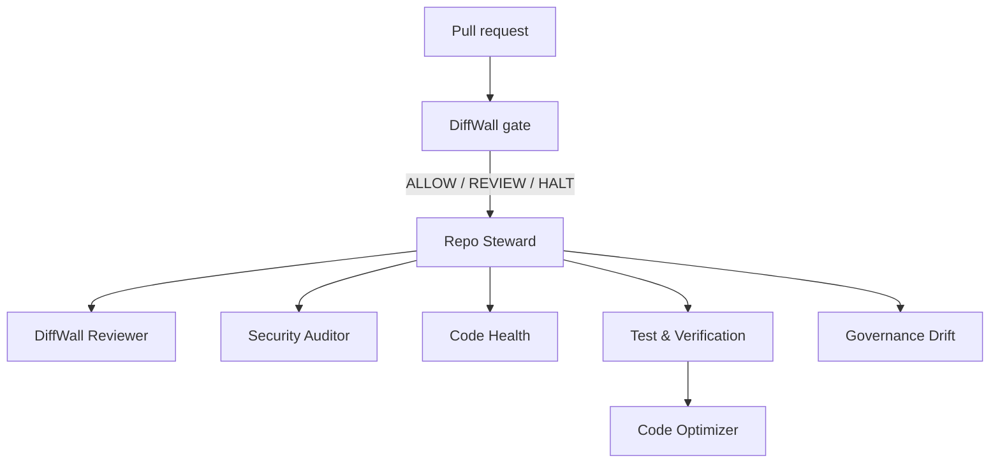

# Repository Agent Team + DiffWall

Status: reference implementation, draft PR #2, pending human merge review.

This layer gives each repository one deterministic change-time gate and a small specialist agent team. DiffWall owns risk routing. Model-based agents add interpretation, security review, health analysis, verification, optimization, and governance-drift detection without overriding the deterministic gate.

## Architecture

DiffWall is pinned to `dburt-proex/diffwall/action@v0.2.0` in consumer repositories. The DiffWall repository itself keeps its existing self-scan workflow instead of installing a redundant consumer workflow.

## Authority matrix

| Agent | Tool scope | Autonomous | REVIEW boundary | HALT / prohibited |
|---|---|---|---|---|
| Repo Steward | read, search, agent, GitHub read | route and synthesize | missing evidence, unclear scope | edit, merge, deploy, permissions |
| DiffWall Reviewer | read, search, GitHub read | interpret diff + DiffWall evidence | missing DiffWall evidence | downgrade HALT, edit, merge |
| Security Auditor | read, search, execute, GitHub read | non-mutating inspection/scanners | material uncertainty | expose secrets, install/upgrade, credential or permission changes |
| Code Health Reviewer | read, search, execute | health analysis, non-mutating checks | ambiguous architecture/impact | edit code, style-only churn |
| Code Optimizer | read, search, edit, execute | bounded optimization after explicit assignment | unclear behavior or protected boundary | weaken security/governance, merge, deploy |
| Test & Verification | read, search, edit, execute | run checks; edit tests/fixtures when asked | missing deps/services or unverified protected behavior | edit production code, invent passing results |
| Governance Drift | read, search, GitHub read | detect scope/policy/permission drift | missing source-of-truth policy | edit policy, invent policy |

The `execute` tool does not imply unrestricted mutation: Security and Code Health are instructed to run only non-mutating commands. Code Optimizer and Test & Verification are the only roles with file-edit tooling, and their edit boundaries are explicit.

## Routing

1. Pull request opens, synchronizes, or reopens.
2. DiffWall scans the immutable PR base SHA against `HEAD`.
3. DiffWall publishes evidence and routes `ALLOW`, `REVIEW`, or `HALT`.
4. Repo Steward invokes the smallest specialist set required.
5. A model reviewer may add findings but may never downgrade DiffWall `HALT`.
6. Optimization begins only after a verification baseline and ends with verification using the same metric/check.
7. Merge, deploy, permission expansion, credentials, and policy bypass remain human-gated.

## Failure behavior

- DiffWall missing/not run: `REVIEW`.
- Required test/check cannot be verified: `REVIEW`.
- Ambiguous ownership or scope: `REVIEW`.
- Critical vulnerability, destructive path, credential handling, or unsafe permission expansion: `HALT`.
- A repository rejects safe branch creation: stop that repository only; do not write directly to its protected/default branch.

## Files

- `.github/workflows/diffwall.yml`: consumer PR firewall.
- `.github/agents/*.agent.md`: GitHub custom-agent profiles.

GitHub reference: https://docs.github.com/en/copilot/concepts/agents/cloud-agent/about-custom-agents
Custom-agent configuration: https://docs.github.com/en/copilot/reference/custom-agents-configuration

## Acceptance criteria

- rollout occurs on a dedicated branch and draft PR;
- no unrelated file is changed;
- consumer PR contains exactly seven agent profiles plus the DiffWall workflow;
- DiffWall repository contains exactly the seven agent profiles and preserves its existing self-scan workflow;
- DiffWall workflow completes and posts route evidence;
- exceptions are recorded rather than bypassed.
